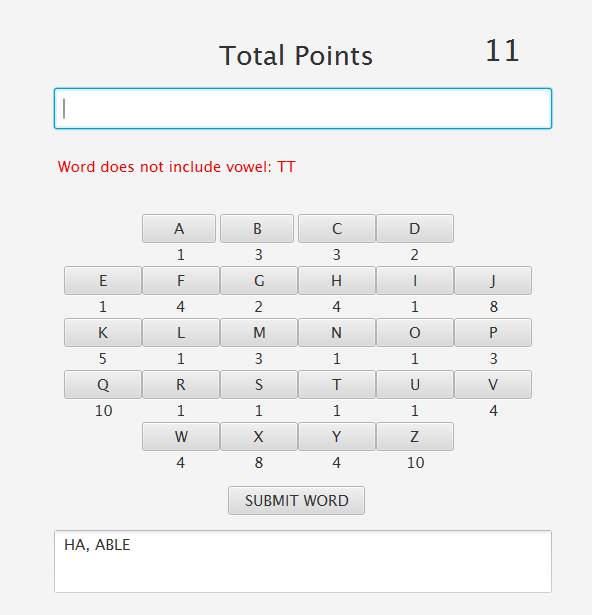

## Scrabble Points Generator Version A

### Description
A JavaFX application named "Scrabble points Generator".
 The application will allow the user to TYPE in a word  or CLICK word buttons and it will calculate how many points that word is
using the scrabble point system.
 

 

####  The Scrabble Point/Letters System
For example, there are 9 "A" letters in the bag in scrabble. If the user enters the words "ha" and "able", there are only 7 "A" letters left. And the point is 11 (HA: 5, ABLE: 6). 

 

#### Rules
<ul>
<li>Two letters minumum, one letter must be vowel (A, E, I, O, U, or Y)</li>

 
<li>8 letters maximum</li>

<li>Cannot have duplicate words</li>

<li>The game's over when :</li>
&nbsp; - only consonants remaining.
  
 &nbsp; - only one letter remaining in the bag.
  