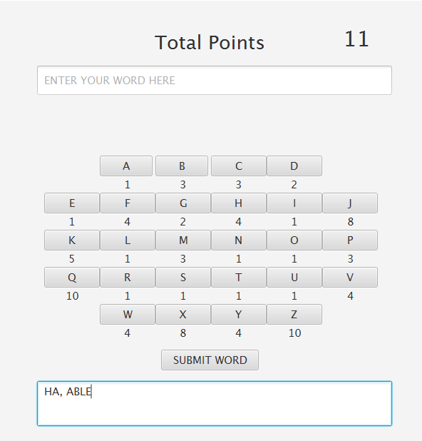
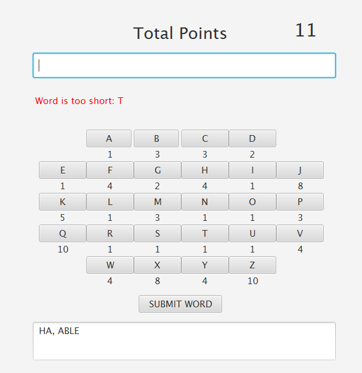
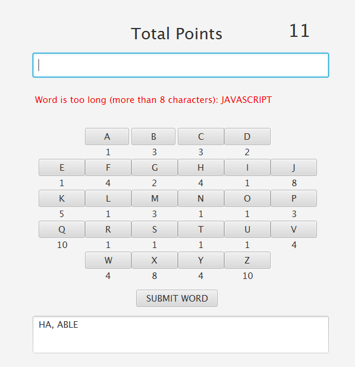
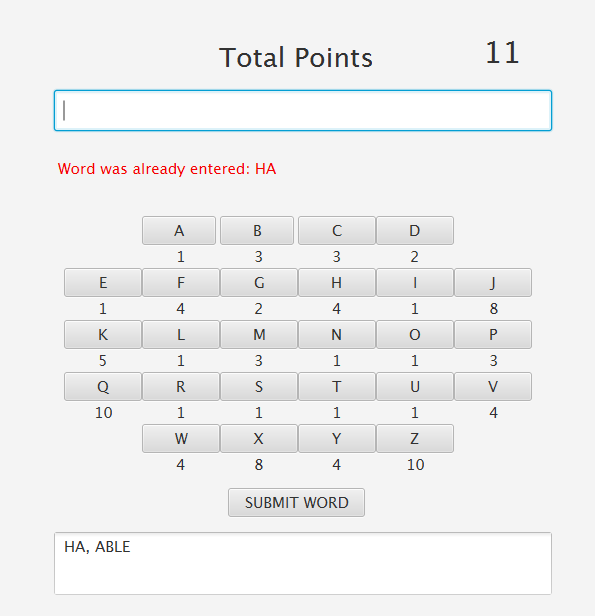
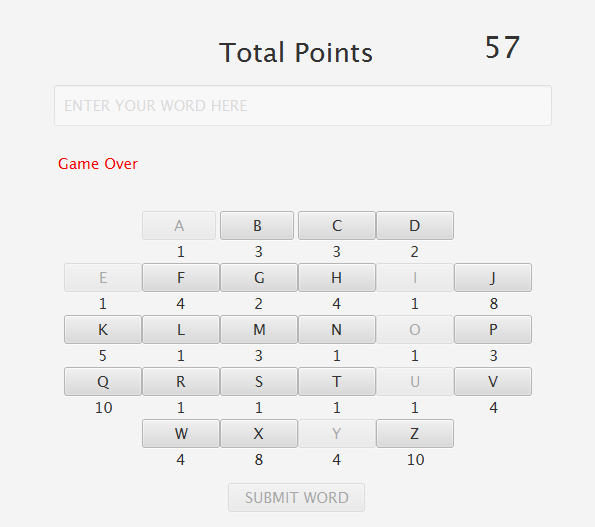
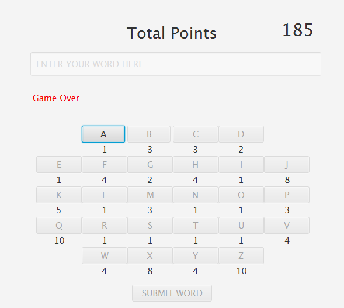

## Scrabble Points Generator Version A

### Description
A JavaFX application named "Scrabble points Generator".
 The application will allow the user to TYPE in a word  or CLICK word buttons and it will calculate how many points that word is
using the scrabble point system.

 

####  The Scrabble Point/Letters System

For example, there are 9 "A" letters in the bag in scrabble. If the user enters the words "ha" and "able", there are only 7 "A" letters left. And the point is 11 (HA: 5, ABLE: 6). 
 

#### Rules
- Two letters minumum, one letter must be vowel (A, E, I, O, U, or Y)

- 8 letters maximum

- Cannot have duplicate words

- The game's over when :
 &nbsp; - only consonants remaining.

&nbsp; - only one letter remaining in the bag.
